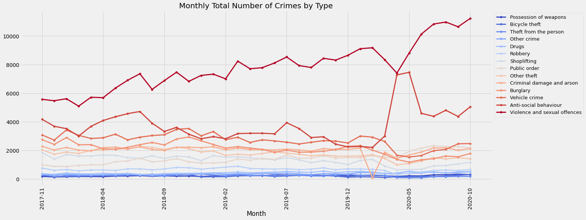
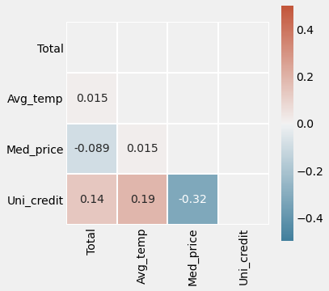
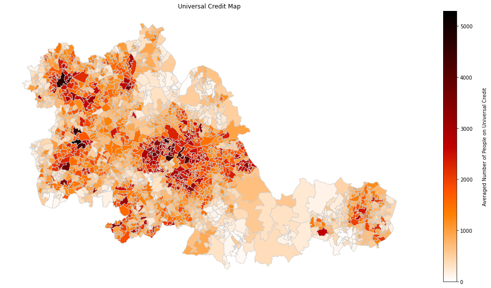

# Forecasting Monthly Crimes in West Midlands Policing Areas 
## Project Overview

<!-- #region -->
- Created a predictive policing tool that predicts monthly number of crimes for a specific type of crime at LSOA geographical level to help law enforcement for effectively allocating crime prevention resources.

- Scraped data from various resources for feature engineering  

- Created a cross-validation class which splits data into train and test on the basis of date and target encoders that encode each level of categorical column with corresponding target mean calculated by the past target values using the time-based cross-validation class. 

- Optimised and Compared Linear, Polynomial, Lasso, Random Forest, and Gradient Boosted Trees using GridSearchCV to find the best model. 

- Built a web application using Flask to deploy the model.
<!-- #endregion -->

<!-- #region -->
## Code and Resources Used

**Python Version:** 3.8

**Packages:** pandas, numpy, matplotlib, seaborn, geopandas, requests, re, bs4, html5lib, datetime, ipywidgets, itertools, dateutil.relativedelta, category_encoders.utils, pickle, sklearn, xgboost, lightgbm

**Time-Based CV Article:** https://towardsdatascience.com/time-based-cross-validation-d259b13d42b8

**Flask:** https://blog.cambridgespark.com/deploying-a-machine-learning-model-to-the-web-725688b851c7

<!-- #endregion -->

<!-- #region -->
## Data Collection

The data is collected from various resources:

- Monthly street-level crime, broken down by type, LSOA: https://data.police.uk/data/

- Shapefile of LSOA within West Midlands Policing areas: https://borders.ukdataservice.ac.uk/bds.html 

- Monthly Average temperature from 2017-11 to 2020-10 in West Midlands (web scraping):
https://www.timeanddate.com/weather/uk/birmingham/

- Median price paid for residential properties by LSOA, England and Wales, year ending Dec 1995 to year ending Mar 2020:
https://www.ons.gov.uk/peoplepopulationandcommunity/housing/datasets/medianpricepaidbylowerlayersuperoutputareahpssadataset46

- Number of people on Universal Credit by LSOA from 2017-11 to 2020-10 in West Midlands:
https://stat-xplore.dwp.gov.uk/webapi/jsf/login.xhtml?invalidSession=true&reason=Session+not+established.

<!-- #endregion -->

<!-- #region -->
## Data Cleaning

After collecting the data, in order to combine and prepare the data for modelling, the following changes were made:

- Removed crime records that were not occurred within West Midlands Policing areas

- Removed columns that were not relevant or providing duplicate information (e.g. 'Reported by', 'LSOA code')

- Aggregated crime records by grouping crime records by Date, LSOA and type of crime and counting the number of occurrences per group which created a new column 'Total'

- Added rows of groups of crime records that are possible but not observed and indicated there was no occurrence by 'Total' = 0

- Added new columns for :

  * average temperature for each month
  * median house price for each LSOA and month
  * number of people on universal credit for each LSOA and month

- Imputed missing median house price with averaging over all the available price records for a given LSOA

- Imputed missing median house price without any price record by averaging over the median house price of LSOAs within corresponding MLSOA for each month

- Replaced nill or negligibly small value indicateor ':' with 0
<!-- #endregion -->

## EDA

Some notable findings are:

- Some changes in crime trend has been observed from March 2020 onwards due to Covid-19 pandemic and lockdown

 

- Areas that each type of crime occurred the most and correlation matrix
<table><tr>
    <td></td>
    <td> </td>
    </tr></table>

- Relationship between a particular type of crime and Universal Credit
<table><tr>
    <td></td>
    <td></td>
    </tr></table>

<!-- #region -->
## Model Building

### Time-based Cross-Validation
This project aims to mimic real world scenarios in which the predictive model is trained over some period and then applied to predict on the upcoming period data. Thus the train/test splits were made by the method called **forward-chaining**. Using this method, each month was considered successively as the test set and assign all previous months into the training set.

### Target Encoding with Time-based Cross-Validation
First, categorical variables were encoded using FCTargetEncoder. FCTargetEncoder calculates the mean of the target variable for each category using only the target value of all the previous month(s) and replace the categorical variable with the mean value. As a result, the data from the first month, 2017-11 was discarded for model building as there was no previous data to encode categorical variables of this month. 

### Nested Time-based Cross-Validation for Model Selection
Using nested time-based cross-validation, an outer loop is to split the data into training and test periods, and an inner loop is used to selelct the model via time-based cross-validation on the training period. After model selection, the test period is then used to evaluate the model performance. 

In this project, the first 24-months was used for the first training period and model performance was tested on the upcoming month. Then the current test month became the part of training period for predicting the next month and so on. As a inner loop, each training period from the outer loop was split to training and validation period for optimising the hyperparamters of each model. For instance, the first 23-month from the first training period was used for training then applied to validate on the 24th month. 

Different regression models were evaluated by **Mean Absolute Error**. MAE was chosen as it is robust to the effect of outliers.  Some cross-validation periods were observed to contain outliers that were seemingly caused by Covid-19 pandemic.  

The models that were considered:

* Multiple Linear Regression - Baseline for the model

* Polynomial Regression

* Lasso Regression 

* Random Forest

* Gradient Boosted Trees

<!-- #endregion -->

<!-- #region -->
## Model Performance

The Random Forest and Gradient Boosted Trees were found to be better model than other models. 

- Gradient Boosted Trees : MAE = 0.8327629853921195

- Random Forest : MAE = 0.8369630883520173

- Polynomial Regression (2nd degree): MAE = 0.8623920739933942 

- Lasso Regression : MAE = 1.0241801679983207

- Linear Regression : MAE = 1.0342114979110544

**The final model**

- Gradient Boosted Trees : MAE = 0.8141224744495286
<!-- #endregion -->

## Productionisation

The final model was deployed as a web application where users can input variables such as a crime type and a location of their interest to get the predicted number of crimes for a given month. The web application was built using Flask and deployed to an online platform for public access. 

**The crime prediction model is accessible via https://crime-prediction-model.herokuapp.com**
